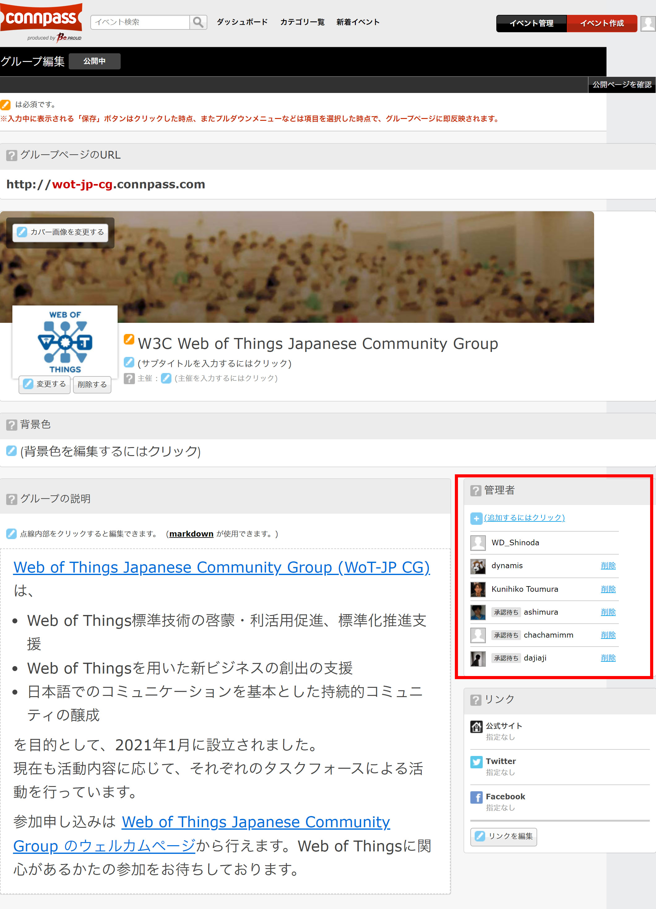
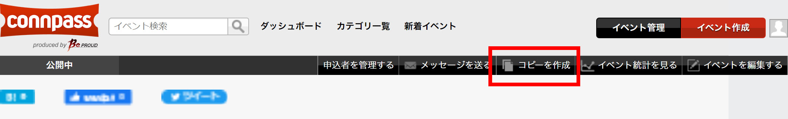
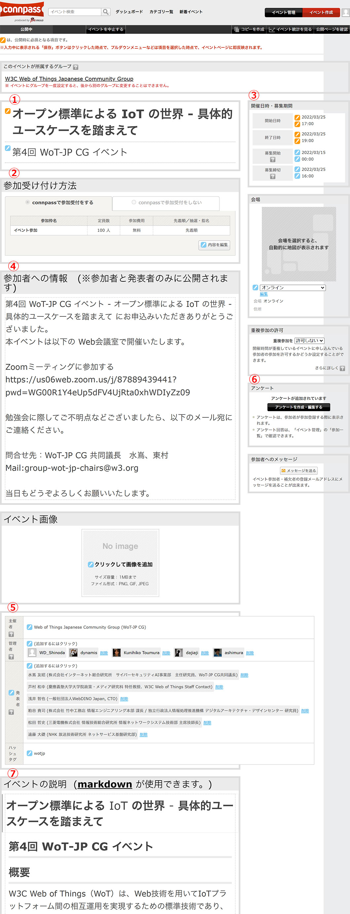

# イベント募集の connpass サイト更新手順

WoT-JP CG 主催イベントは connpass の [wot-jp-cg グループ](https://wot-jp-cg.connpass.com/) で募集しています。

## イベント編集の前提条件 (管理者権限の付与/承認)
- イベントの募集を connpass にて行うに際しては connpass の wot-jp-cg グループ管理者の権限が必要になります。
- connpass 管理者の追加はグループの画面右上に表示される「グループを編集する」から行う事が出来ます。
  
- connpass 管理者に招待された方は、connpass にログインして招待を承認をしてください。
  - ログイン状態で https://wot-jp-cg.connpass.com/ にアクセスすると管理権限の招待が来てるという通知バーがでるので accept 頂ければ。 
- グループの設定なども適宜確認して変更を行ってください。

## connpass 募集作成手順

- connpass は既に開催されたイベント募集をコピーして編集することが出来ます。
  
  - 新しいイベントの募集を行うに際し、以前の告知条件が共通する場合にはコピーを作成して編集するのが手軽で間違いありません。
  - コピーを作成する場合、所属するグループも複製されます。これは後から変更が不可なので、異なるグループ設定が必要な際には注意してください。
- 以下の内容について変更を行います（コピーを作成する際にも同様）
  
1. 「タイトル」を変更する　
   - ※文字数制限も鑑みつつ、サブタイトルと分けて上手く記述してください。
2. 「参加受け付け方法」を編集する　
   - ※無償のイベントも、有償のイベントも設定が出来ます
3. 「募集日時」「開催日時」を設定する
   - 「募集締切」は開催日の直前まで (開始 1 時間前など) とする
4. 「参加者への情報」の編集　
   - ※申し込みした人がページを見た際に表示される内容を編集します
5. 概要の編集「主催者」「管理者」「発表者」「ハッシュタグ」を編集します
6. 「参加申し込み」時のアンケートの設定をする　
   - ※「アンケートを作成・編集する」から編集画面に入ってください。
   - 過去の履歴より「複製」する事で以前の内容が複製されます。
   - 追加・削除を行う場合には、編集画面寄り適宜設定してください。
7. 「イベントの説明」（内容について）を更新します。markdown で記述が可能です。
- 編集内容は公開後も変更が可能です。
- イベントの中止（削除）も可能ですが、応募者が出るとページ削除が出来なくなりますので、注意してください。
- 更新を終えたら「公開ページを確認」で表示確認をして、問題がないことを確認してから公開開始してください。
