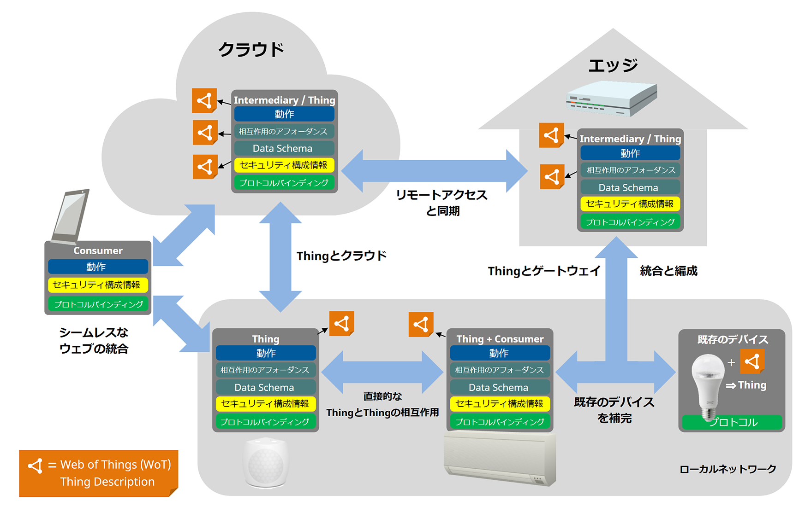

# Web of Thingsについて

Web of Things (WoT) とは、Web のレベルにおける『モノ』の記述の標準化であり、IoT (Internet of Things) プラットフォームとアプリケーション領域にまたがる相互運用性の実現を目的としているものです。

Web of Thingsは、スマートホーム、製造業、スマートシティ、小売業、ヘルスケアアプリ等の複数の IoT 領域に応用が可能であり、W3CのWoT標準を利用することにより、複数のベンダやエコシステムが提供するデバイスを組み合わせたIoTシステムの開発を簡単なものとします。

(出典:[Web of Things (WoT) Architecture 和訳: 図18 W3C WoTの抽象アーキテクチャ](https://wot-jp-community.github.io/wot-architecture/#architecture-abstract) 一部改変)

様々なモノやデバイスを統合し相互運用を実現するために、それぞれのモノやデバイスのエントリポイントとして、WoT Thing Description (TD)が用いられます(ウェブサイトのindex.htmlとよく似ています)。  
Thing Descriptionは、Web of Things (WoT) の中心的な構成要素であり、プログラミング言語やプロトコルに依存しないメタフレームワークです。

Thing Descriptionを介することで、さまざまなIoTプラットフォームおよびアプリケーションを、容易に統合化することが可能となります。  
いわばWoTは、サイロと化したIoTのそれぞれのPlatform全体の屋根という役割を果たすものです。

  
(出典:[第1回 WoT-JP CG全体会議 資料 : WoTの現状とビジョン p14](https://github.com/w3c/wot-jp-cg/blob/main/Event/20211222_1st_Main_Meeting/20211222-WoT-JP_CG_Ashimura.pdf))

## Thingを作る/WoT対応にするには?

Web of Thingsは、IoTのための特定のプラットフォームを規定するものではありません。
その代わりに、なんらかのネットワーク経由のインターフェースをもったモノを
- そのものが何で
- どうやってアクセスすればいいのか

を'Thing Description'という文書の形で記述します。
Thing Descriptionを作って適切なアクセス制御をのもとで公開することを
"ThingをExposeする"、また、Thing Descriptionを読んでThingへのアクセス方法を
知ることを"ThingをConsumeする"といいます。

(出典:[Web of Things (WoT) Architecture: Figure 23 High-level architecuture of Consumer and Thing](https://www.w3.org/TR/wot-architecture/#high-level-application-device))

WoTのThing Descriptionで記述されるThingの大半は、HTTPベースの
インターフェースをもったものです。このため、
新たにThingをつくるのであれば、HTTPベースのインターフェース経由でアクセス可能なデバイスをつくれば、それで「WoT対応」になります。

また、[Thingweb node-wot](http://www.thingweb.io/)などの実装をつかって、
Thing DescriptionからHTTPインターフェースを自動生成するのもよいでしょう。

## ThingをExposeするには?

Thingを他のシステムから使えるようにするには、
そのThingをThing Descriptionで記述し、それをなんらかの形で他のシステムに渡す
必要があります。

Thing DescriptionはJSON-LDフォーマットのテキストファイルなので、
適当なテキストエディタで書くことができます。また、[Thingweb Playground](http://plugfest.thingweb.io/playground/)を使えば、記述の不備をチェックすることもできます。

現時点ではThing Descriptionの公開方法は定められていないので、
例えばThing Descriptionを置いたURLを相手に伝えるのでも良いでしょう。
もし大規模なシステムで、Thing Descriptionの検索などの機能が必要な場合は
[Linksmart Thing Directory](https://github.com/linksmart/thing-directory/blob/master/README.md)の導入も考えられるでしょう。

## ThingをConsumeするには?

Thing Descriptionを人が読んで理解して、アクセスするためのプログラムを
記述してもWoTは実現可能ですが、なんらかのツールを利用してアクセスするための
基盤をつくるのが通常です。

例えば、[Node-RED Node Generator](https://github.com/node-red/node-red-nodegen)は[Node-RED](https://nodered.org/)というグラフィカルなプログラミングツールからWoTのThingを扱えるようにするツールで、Thingを表す「ノード」とつなぎ合わせることでThingを組み合わせたIoTソリューションを簡単に実装できます。

また、「Thingを作る」でふれたnode-wotを使えば、TypeScriptのオブジェクトとして
Thingを扱うことが可能になります。

以上のように、Thing Descriptionを介してさまざまなIoTデバイスとアプリケーションをつなぎ合わせることができるのがWoTの特長です。
