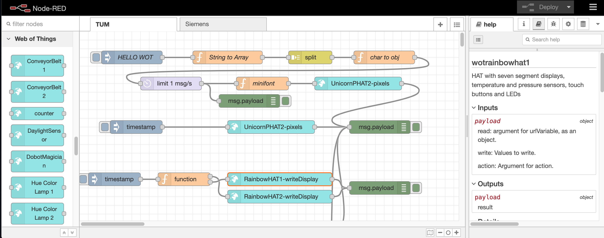

# Web of Thingsについて

Web of Thingsは、IoTのための特定のプラットフォームを規定するものではありません。
その代わりに、なんらかのネットワーク経由のインターフェースをもったモノを
- そのものが何で
- どうやってアクセスすればいいのか

を'Thing Description'という文書の形で記述します。
Thing Descriptionを作って適切なアクセス制御をのもとで公開することを
"ThingをExposeする"、また、Thing Descriptionを読んでThingへのアクセス方法を
知ることを"ThingをConsumeする"といいます。

(出典:[Web of Things (WoT) Architecture: Figure 23 High-level architecuture of Consumer and Thing](https://www.w3.org/TR/wot-architecture/#high-level-application-device))

## Thingを作る/WoT対応にするには?

WoTのThing Descriptionで記述されるThingの大半は、HTTPベースの
インターフェースをもったものです。このため、
新たにThingをつくるのであれば、HTTPベースのインターフェース経由でアクセス可能なデバイスをつくれば、それで「WoT対応」になります。

また、[Thingweb node-wot](http://www.thingweb.io/)などの実装をつかって、
Thing DescriptionからHTTPインターフェースを自動生成するのもよいでしょう。

## ThingをExposeするには?

Thingを他のシステムから使えるようにするには、
そのThingをThing Descriptionで記述し、それをなんらかの形で他のシステムに渡す
必要があります。

Thing DescriptionはJSON-LDフォーマットのテキストファイルなので、
適当なテキストエディタで書くことができます。また、[Thingweb Playground](http://plugfest.thingweb.io/playground/)を使えば、記述の不備をチェックすることもできます。

現時点ではThing Descriptionの公開方法は定められていないので、
例えばThing Descriptionを置いたURLを相手に伝えるのでも良いでしょう。
もし大規模なシステムで、Thing Descriptionの検索などの機能が必要な場合は
[Linksmart Thing Directory](https://github.com/linksmart/thing-directory/blob/master/README.md)の導入も考えられるでしょう。

## ThingをConsumeするには?

Thing Descriptionを人が読んで理解して、アクセスするためのプログラムを
記述してもWoTは実現可能ですが、なんらかのツールを利用してアクセスするための
基盤をつくるのが通常です。

例えば、[Node-RED Node Generator](https://github.com/node-red/node-red-nodegen)は
[Node-RED](https://nodered.org/)というグラフィカルなプログラミングツールから
WoTのThingを扱えるようにするツールで、Thingを表す「ノード」とつなぎ合わせることで
Thingを組み合わせたIoTソリューションを簡単に実装することができます。

また、「Thingを作る」でふれたnode-wotを使えば、TypeScriptのオブジェクトとして
Thingを扱うことが可能になります。

以上のように、Thing Descriptionを介してさまざまなIoTデバイスとアプリケーションをつなぎ合わせることができるのがWoTの特長です。
