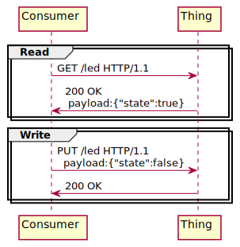
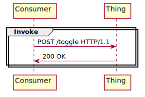
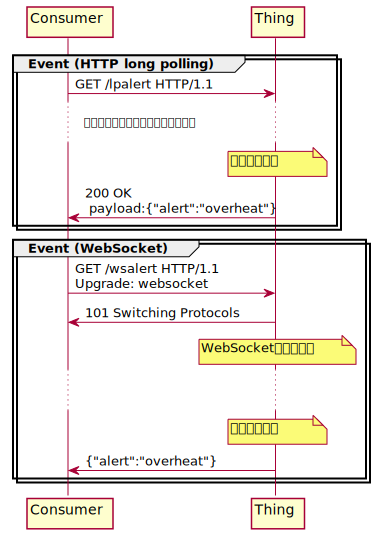

# WoTの基本的なやりとり

Web of Thingsでは、IoTデバイスとの相互作用をProperty、Action、
Eventの3つに抽象化しています。理論的には、これらの相互作用に
対して記述可能な任意のプロトコルを利用することができますが、
ここではHTTPを使った場合の典型的なシーケンスとThing Descriptionの記述を示します。

<!-- Property, Action, Eventの簡単な説明をここに書く -->

## Property

Propertyでは、Thingがもつ属性値を読み書きする操作を記述します。
温度センサが保持している現在温度の値を読んだり、LEDの点灯状態を書き換えることで
LEDを点灯させたりする操作がこれにあたります。

Propertyのシーケンス例を下記に示します。



Consumerは、GETリクエストで属性値を読み、PUTリクエストで書き込みます。
データ形式はJSONを用いるのが一般的です。上記の相互作用の仕方を
Thing Descriptionで記載すると下記のようになります(properties部分のみ抜粋)。

```JSON
{
    //...
    "properties": {
        "ledstatus": {
            "type": "object",
            "properties": {
                "state": {
                    "type": "boolean"
                }
            },
            "forms": [{
                "href": "https://mylamp.example.com/led"
            }]
        }
    }
    //...
}

```
この記述は:
- このThingは"ledstatus"という属性をもつ
- その属性値は`{"status": trueまたはfalse}`という値をもつ
- その属性値は読み書き可能である(デフォルト値より)
- アクセスするには`https://mylamp.example.com/led`を使う
- 属性値を読む際のHTTPメソッドは`GET`(デフォルト値より)
- 属性値を書く際のHTTPメソッドは`PUT`(デフォルト値より)
- ペイロードのタイプは`application/json`形式(デフォルト値より)

ということを意味しています。


## Action

Actionでは、Thingに対してなんらかの動作を指示したり、Thingが持つ機能を実行させる操作を記述します。
例えば、LEDランプのスイッチをトグルする、スピーカから合成音声を音声を鳴らす、といった操作がこれにあたります。

Actionのシーケンス例を下記に示します。



ここでは、ConsumerがPOSTリクエストでLEDのランプのスイッチをトグルしています。
POSTリクエストと返答に含まれるボディ部は使っていません。
この相互作用の仕方をThing Descriptionで記述すると下記のようになります。

```JSON
{
    //
    "actions": {
        "toggle": {
            "forms": [{
                "href": "https://mylamp.example.com/toggle"
            }]
        }
    }
}

```
この記述は:
- このThingは"toggle"というアクションを受け付ける
- このアクションの起動の副作用によりThingの属性値が変わる可能性がある(デフォルト値より)
- このアクションの起動は冪等(idempotent)な操作ではない(デフォルト値よる)
- アクションを起動する際のHTTPメソッドは`POST`(デフォルト値より)

ということを意味しています。

なお、ここではPOSTメソッドでアクションを実行していますが、Thingの実装によっては属性値の取得(GET)を契機にアクションを起動したり、属性値を書き換える(PUT)ことによってアクションを起動することがあるかもしれません。
この場合、前節で述べたpropertyの読み書きとしてアクションを記述することもできますが、
Thingの利用者にとってそれがなんらかの動作として抽象化した方がいい場合は、アクションとして記述することをお勧めします。

たとえば、`https://mylamp.example.com/invokeaction`というURLにPUTリクエストで`{"action": "toggle"}`を書き込むと
動作が起動する場合、書き込み可能な属性値として抽象化するより、アクションの起動として抽象化したほうが
Thingの利用者にわかりやすくなります。
このような場合のThing Descriptionの記述は下記のようになります。
```JSON
{
    // ...
    "actions": {
        "toggle": {
            "input": {
                "type": "object",
                "properties": {
                    "action": {
                        "const": "toggle"
                    }
                }
            },
            "forms": [{
                "href": "https://mylamp.example.com/invokeaction",
                "htv:methodName": "PUT"
            }]
        }
    }
}
```

この例では、
- `input`による指示: アクション起動時のために書き込む値は`{"action":"toggle"}`
- `htv:methodName`による指示: アクション起動時に使うHTTPメソッドは`PUT`

ということを示しています。

## Event

Eventでは、Thing側から通知を受ける形の動作を記述します。
例えば、LEDランプに異常が発生した通知、あるいは定期的にLEDの点灯状態を受け取るような場合です。

Eventのシーケンス例を下記に示します。



ここでは、HTTPでのイベント通知の代表例であるlong pollingとWebSocketを使ったシーケンスを示しています。

Long pollingでは、event通知のために通常のHTTP要求を使います。
通常のHTTP要求の場合、要求に対する返答がすぐに返りますが、long pollingの際には
イベントの発生まで返答を保留し、イベントが発生じた時点で返答を返すことでConsumer側にイベントを通知します。
WebSocketでは、事前の要求で確保されたWebSocketのストリームを介してイベントが通知されます。

この2つのイベント通知の仕方をThing Descriptionで記述すると以下のようになります。

```JSON
{
    // ...
    "events": {
        "alert": {
            "data": {
                "type": "object",
                "properties": {
                    "alert": {
                        "type": "string"
                    }
                }
            },
            "forms": [{
                "href": "https://mylamp.example.com/lpalert",
                "subprotocol": "longpoll"
            },{
                "href": "wss://mylamp.example.com/wsalert"
            }]
        }
    }
}
```
この記述は:
- このThingは"alert"というイベントを発行する
- このイベントは、`{"alert":文字列}`という形式で表現される。
- イベントを受信するためには2つの方法がある
  - HTTP long pollingを使う方法
  - WebSocketを使う方法

ということを示しています。

イベントの受信をやめるための方法も記述できますが、説明は省略します。

この例では、long pollingでのイベント受信はHTTP GETリクエストを使っており、
「イベント」という属性値を読み出す、と解釈してpropertyの読み出しとして書くこともできそうです。
しかし、これはThingの利用者から見ると「読み出そうとしてもイベントが発生するまで返答がない属性値」と
して見えてしまうため、ただしくEventとして抽象化することが必要です。

## まとめ
ここでは、HTTPを使ったThingとの相互作用の方法とその記述方法を示しました。
このほかにも、
- Propertyの値に変化があったら通知するための`observeproperty`
- Eventの受信を終了するための`cancellation`
- アクセスに必要なセキュリティの情報を記述するための`securityDefinitions`

などがありますが、まずはここで説明した最も基本的な相互作用パターンをつかって
Thingを作成するのが良いでしょう。

