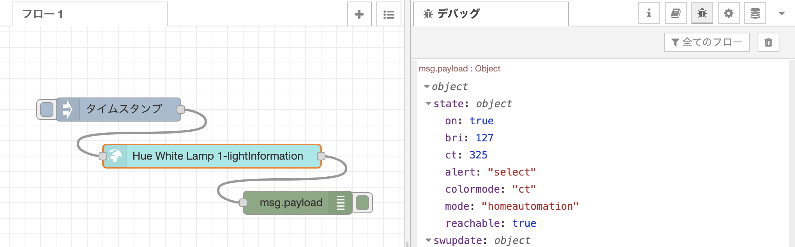
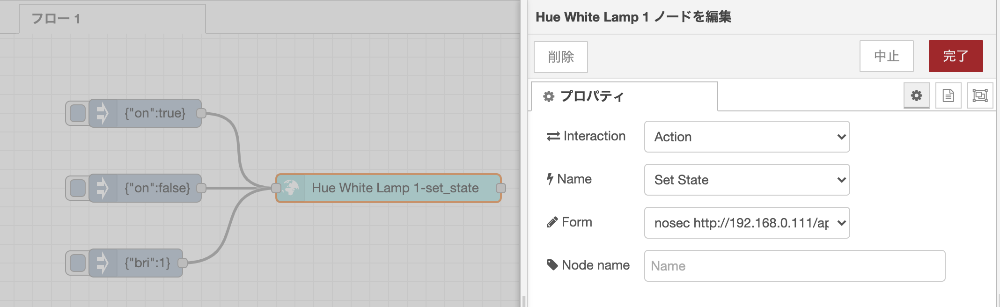

# Hue 電球 ホワイトグラデーション

[Philips Hue スマート電球 ホワイトグラデーション](https://www.philips-hue.com/ja-jp/p/hue-white-ambiance-1-pack-e26/8718699722302)
を Thing として扱うための手順です。[WoTify](https://wotify.org/ )にある Thing Description を元に、Node-RED と node-red-nodegen を使用します。

本サンプルでは、REST API が既に用意されており、エンドポイントを決め、API の URL を Thing Description、ノードモジュールへと対応づける例として、 Hue を取り上げ WoT 化を行います。  

### 必要なもの
- ハードウェア
  - [Philips Hue ブリッジ](https://www.philips-hue.com/ja-jp/p/hue-bridge/8719514342460)
  - [Philips Hue スマート電球 ホワイトグラデーション](https://www.philips-hue.com/ja-jp/p/hue-white-ambiance-1-pack-e26/8718699722302)
  - Hueと同一のネットワーク上にあるPCやRaspberry Piなど
- ソフトウェア
  - [Node-RED v2.0 以降](https://nodered.org/)
  - [Node Generator (node-red-nodegen)](https://github.com/node-red/node-red-nodegen)

## Hueのセットアップ

公式の開発者ページ
[Get Started](https://developers.meethue.com/develop/get-started-2/)
に従い進めていきます。  
ブリッジと同一のネットワークにて<https://discovery.meethue.com>にアクセスしIPアドレスを確認、  
`https://<bridge ip address>/debug/clip.html`のインタフェースにアクセスします。

次に、表示されたインターフェースにて、ユーザ名を取得するために、
- URL: `/api`
- Body: `{"devicetype":"my_hue_app#iphone peter"}`
- Method: POST

を行います。この際に、ブリッジのボタンを押す必要があるメッセージが返されます。ボタンを押し、再びPOSTを行うことで、username が得られます。

## Thing Description

今回は、
[WoTify にある Philips HUE White Light の Thing Description](https://wotify.org/library/Philips%20HUE%20White%20Light/general)
を利用します。

[WoTify](https://wotify.org/) より [Philips HUE White Light の Thing Description](https://wotify.org/library/Philips%20HUE%20White%20Light/general) をダウンロードの上、base URI の  
`"base": "http://192.168.0.111/api/R6D7CYQFzXckikMPLEL8WbSZWg9XKkEyx-NrgKws/lights/1/"`  
の箇所を先ほど確認した、IPアドレスとユーザ名にそれぞれ置き換えて使います。

## 使用例

上記の Thing Description を元にして JSON-LD ファイルを作成し、
[node-red-nodegen](https://github.com/node-red/node-red-nodegen) を使用して[ノードモジュールを作成](https://github.com/node-red/node-red-nodegen/wiki#how-to-create-a-node-from-wot-thing-description)します。

```sh
npx node-red-nodegen lightTD1.jsonld
npm --prefix ~/.node-red install ./node-red-contrib-wotlightTD1
```
### 電球の状態を表示する

Thing Description の`properties`の一部を引用し注目すると、`title`から、電球の状態を持っており、`forms`から、それらの情報に読み書きアクセス可能であることがわかります。
また、`type`,`properties`から、それらの情報はJSONで表現されることがわかります。

```javascript
...
  "properties": {
      "lightInformation": {
          "title": "State and Attributes Of Light",
          "description": "Gets the attributes and state of a given light",
          "type": "object",
          "properties": {
              "state": {
                  "description": "Details the state of the light, see the state table below for more details.",
                  "type": "object",
                  "properties": {
                      "on": {
                          "description": "On/Off state of the light. On=true, Off=false",
                          "type": "boolean",
                          "readOnly": true,
                          "writeOnly": false
                      },
                      ......
                      "bri": {
                          "description": "brightness level",
                          "type": "integer",
                          "minimum": 0,
                          "maximum": 254,
                          "readOnly": true,
                          "writeOnly": false
                      },
                      ......
                  }
              },
              ......
          },
          "forms": [
              {
                  "href": "",
                  "htv:methodName": "GET",
                  "http:methodName": "GET",
                  "contentType": "application/json",
                  "op": [
                      "readproperty"
                  ]
              },
              {
                  "href": "",
                  "htv:methodName": "PUT",
                  "contentType": "application/json",
                  "op": [
                      "writeproperty"
                  ]
              }
          ]
      }
  },
...
```

したがって、下記のようにHue White Lamp 1ノードを編集することで、電球の状態を表示することができます。

- Interaction: Property
- Name: State and Attributes Of Light
- Access: Read
- Form: `nosec http://...`




### 電球を操作する

Thing Description の`actions`の一部を引用し注目すると、電球のオンオフの操作は、`boolean`によって定義され、明るさは`integer`によって定義されていることがわかります。また、`forms`よりJSONを受け取るように記述されています。

```javascript
...
  "actions": {
    ......
      "set_state": {
          "title": "Set State",
          "description": "Allows the user to turn the light on and off, modify the hue and effects",
          "input": {
              "type": "object",
              "properties": {
                  "on": {
                      "description": "On/Off state of the light. On=true, Off=false",
                      "type": "boolean"
                  },
                  "bri": {
                      "description": "Brightness level. Accepts 255 as well",
                      "type": "integer",
                      "minimum": 0,
                      "maximum": 254
                  },
                ......
              }
          },
          ......
          "forms": [
              {
                  "href": "state",
                  "contentType": "application/json",
                  "htv:methodName": "PUT",
                  "op": [
                      "invokeaction"
                  ]
              }
          ],
        ......
      }
  }
...
```

したがって、Hue White Lamp 1ノードを下記のように設定の上、injectノードで電球の状態のJSONを設定することでHueを操作することが出来ます。

- Interaction: Action
- Name: Set State
- Form: `nosec http://...`



## 応用例 (ディマースイッチ・ブリッジ)

同様の手順で、
[Hue ディマースイッチ](https://www.philips-hue.com/ja-jp/p/hue-dimmer-switch--latest-model-/8719514274655)や
[Hue ブリッジ](https://www.philips-hue.com/ja-jp/p/hue-bridge/8719514342460)
をThingとして扱うことができます。  
下記の[WoTify](https://wotify.org/ )にある Thing Description を元に、それぞれWoT化が可能です。

- [Philips HUE Dimmer Switch の Thing Description](https://wotify.org/library/Philips%20HUE%20Dimmer%20Switch/general)
- [Philips HUE Bridge の Thing Description](https://wotify.org/library/Philips%20HUE%20Bridge/general)
