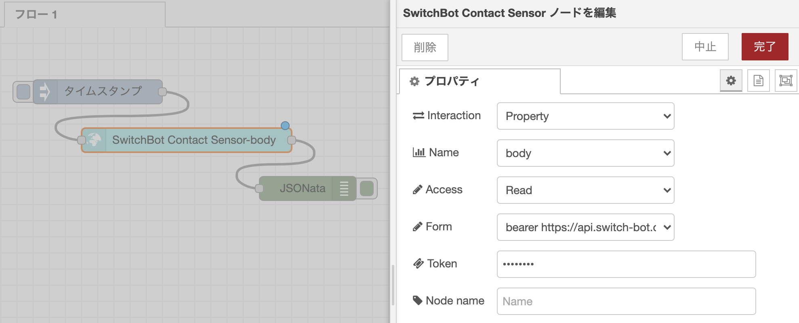
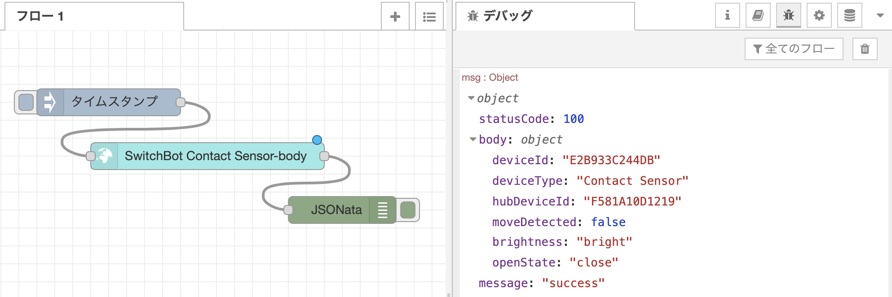

# SwitchBot開閉センサー

[SwitchBot開閉センサー](https://www.switchbot.jp/collections/all/products/contact-sensor) を Thing として扱うための手順です。Thing Description を元に、Node-RED と node-red-nodegen を使用します。

本サンプルでは、REST API が既に用意されているものから、Thing Description を作成し、ノードモジュールへと対応づける例として、 SwitchBot を取り上げ WoT 化を行います。  

## SwitchBotハブのセットアップ

[SwitchBotAPI](https://github.com/OpenWonderLabs/SwitchBotAPI) のページに従い進めていきます。  
なお、SwitchBotAPI を使用するには、ハブとして Hub Plus や Hub Mini が必要になります。

はじめに、認証用のトークンを取得します。

1. SwitchBot アプリをダウンロードします。
1. SwitchBot アカウントにログインします。
1. プロファイルから`設定`に移動し、`アプリバージョン`を10回タップすると`開発者向けオプション`が表示されます。
1. SwitchBot OpenAPIのトークンが発行されます。

発行されたトークンをヘッダーに含めることで、デバイスの状態の取得や操作を行うことが出来ます。

curl などでデバイスのリストやそれぞれのデバイスIDの取得や確認を行います。  
`<token>`の箇所にはそれぞれ先ほど取得したトークンを入力してください。

```
# デバイスのリストの取得
$ curl -X GET -H 'Authorization: <token>' https://api.switch-bot.com/v1.0/devices

# デバイスの状態を取得
# deviceId には上記のデバイスリストの取得で確認したデバイスIDを入力してください
$ curl -X GET -H 'Authorization: <token>' https://api.switch-bot.com/v1.0/devices/<deviceId>/status

```

## Thing Description の例

Thing Description の作成を行なっていきます。  
本サンプルのコード例全体は[こちら](https://github.com/hidessy/wot-examples/blob/main/switchbot/contact-sensor-td.jsonld)です。

今回は、認証用トークンが必要であるため、下記のように、`"securityDefinitions"`にて、`"scheme": "bearer"`を定義します。

```javascript
...
  "securityDefinitions": {
      "bearer_sc": {
          "scheme": "bearer",
          "in":"header"
      }
  },
  "security": [
      "bearer_sc"
  ],
...
```

base URI の`<deviceId>`の箇所は、セットアップで確認したデバイスIDに置き換えます。

```javascript
...
"base": "https://api.switch-bot.com/v1.0/devices/<deviceId>/status",
...
```

プロパティの記述ではSwitchBot開閉センサーに合わせた定義を行なっていきます。

```javascript
...
  "properties": {
      "state": {
          "description": "Contact Sensor information from the Hub",
          "type": "object",
          "properties": {
              "deviceId": {
                  "type": "string",
                  "readOnly": true,
                  "writeOnly": false
              },
              ......
              "openState": {
                  "type": "string",
                  "readOnly": true,
                  "writeOnly": false
              }
          },
          "forms": [
              {
                  "href": "",
                  "contentType": "application/json",
                  "htv:methodName": "GET",
                  "op": [
                      "readproperty"
                  ]
              }
          ]
      }
  }
...
```

その他、省略した部分等の本サンプルのコード例全体は[こちら](https://github.com/hidessy/wot-examples/blob/main/switchbot/contact-sensor-td.jsonld)からご覧ください。

## 使用例

作成した Thing Description を元にして JSON-LD ファイルを作成し、
[node-red-nodegen](https://github.com/node-red/node-red-nodegen) を使用して[ノードモジュールを作成](https://github.com/node-red/node-red-nodegen#example-3-create-original-node-from-thing-description)します。

```sh
npx node-red-nodegen contact-sensor-td.jsonld
npm --prefix ~/.node-red install ./node-red-contrib-wotswitchbotcontactsensor
```
### 開閉センサーの状態を表示する

下記のように SwitchBot Contact Sensor のノードを編集することで、開閉センサーの状態を表示することができます。

- Interaction: Property
- Name: body
- Access: Read
- Form: `bearer https://api.switch-bot...`
- Token: 取得したトークン




