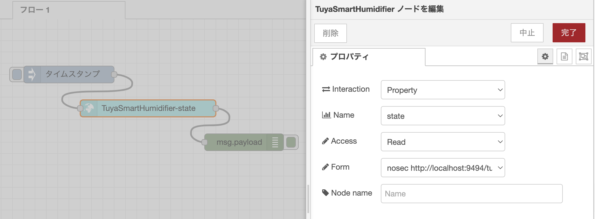
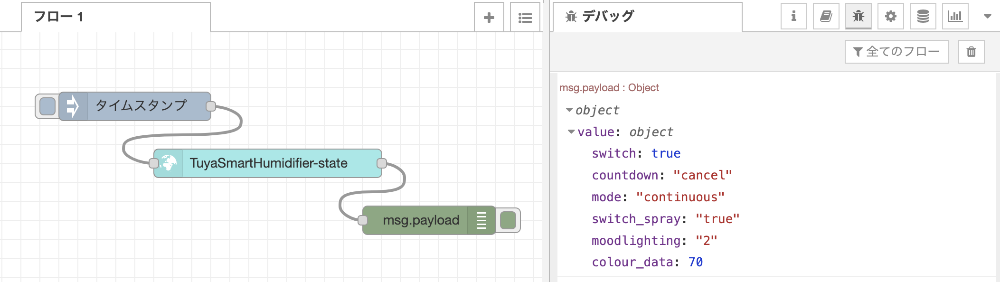
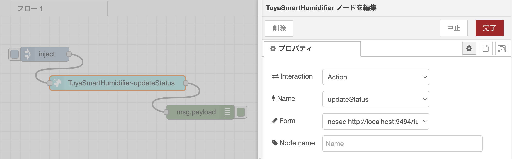

# +Style(Tuya) スマート加湿器

[+Style スマート加湿器](https://plusstyle.jp/shopping/PS-ARO-W01) を [Tuya Cloud Development](https://developer.tuya.com/en), [Python SDK](https://github.com/tuya/tuya-connector-python) を用いてWoT化し、Thing として扱うための手順です。

本サンプルでは、[WoTPy](https://github.com/agmangas/wot-py) を使用して Python SDK を Restful API として操作出来るようにし、ノードモジュールへと対応づける例として、[+Style スマート加湿器](https://plusstyle.jp/shopping/PS-ARO-W01) を取り上げ WoT 化を行います。

### 必要なもの
- ハードウェア
  - [+Style スマート加湿器](https://plusstyle.jp/shopping/PS-ARO-W01)
  - スマートフォン
  - PCやRaspberry Piなど
- ソフトウェア
  - Python 3.7 以降
  - [WoTPy (wotpy 0.16.0)](https://github.com/agmangas/wot-py)
  - Tuya Smart アプリ [Google Play](https://play.google.com/store/apps/details?id=com.tuya.smart), [App Store](https://apps.apple.com/jp/app/tuyasmart/id1034649547)
  - [Tuya IoT Platform](https://iot.tuya.com/cloud/)
  - [tuya-connector-python](https://github.com/tuya/tuya-connector-python)
  - [Node-RED v2.0 以降](https://nodered.org/)
  - [Node Generator (node-red-nodegen)](https://github.com/node-red/node-red-nodegen)

## +Style (Tuya Smart) のセットアップ

[Tuya Cloud Development Platform におけるPythonでの開発手順](https://developer.tuya.com/en/demo/python-iot-development-practice) のページに従い進めていきます。  

はじめに、Tuya Smart アプリをダウンロードし、アカウントを作成・ログイン、デバイスの登録を行います。  
次に、[Tuya IoT Platform](https://iot.tuya.com/cloud/) のアカウントを作成・ログインしAPIで制御できるように設定を行なっていきます。  
手順の詳細は[こちらの公式サイトの説明](https://developer.tuya.com/en/demo/python-iot-development-practice)をご覧ください。

1. [Tuya IoT Platform](https://iot.tuya.com/cloud/)にログイン後、`Cloud`から`Development`に移動し、`My Cloud Projects page`の`Create Cloud Project`より新しいプロジェクトを作成します。
1. プロジェクト作成後、`Devices`タブの`Add Device`より、`Add Device with IoT Device Management App`を選択し、表示されるQRコードをTuya Smart アプリで読み取ります。
1. プロジェクトの`Assets`、`Debug Device`にアクセスし、`Device Debugging`で登録したデバイスを操作できることを確認します。

次に、Pythonで制御するために、[tuya-connector-python](https://github.com/tuya/tuya-connector-python)を使用します。

```bash
pip3 install tuya-connector-python
```

## WoTPy を用いた Thing の作成例

WoTPy を使用して Python で Thing を作成していきます。

本サンプルのコード例全体は[こちら](https://github.com/hidessy/wot-examples/blob/main/tuya/tuya-smart-humidifier.py)です。  
また、WoTPy の GitHub 上の[サンプル](https://github.com/agmangas/wot-py/tree/develop/examples)も合わせてご参照ください。

### Thing Description の作成

Thing Description の作成を行なっていきます。モジュールの import や変数の初期化を行なった後の部分に注目します。

```python
...
TD = {
    "title": "TuyaSmartHumidifier",
    "id": "urn:wot:TuyaSmartHumidifier",
    "description": "This is a WoT example of Tuya Smart Humidifier using WoTPy.",
    "@context": [
        'https://www.w3.org/2019/wot/td/v1',
    ],
    "properties": {
        ......
    },
    "actions": {
        ......
    }
}
...
```

上記の部分でそれぞれ、プロパティとアクションの定義を行ないます。なお、セキュリティの定義については、何も定義していない場合、WoTPy では `nosec` が適用されます。

`properties` では、TuyaのAPIで得られるスマート加湿器の情報に合わせた定義をしていきます。

```python
...
    "properties": {
        "status": {
            "type": "object",
            "properties": {
                "switch": {
                    "type": "boolean"
                },
                "countdown": {
                    "type": "string",
                    "enum": ["cancel", "1", "3", "6"]
                },
                ......
                "colour_data": {
                    "type": "number",
                    'minimum': 0,
                    'maximum': 255
                }
            }
        }
    },
...
```

`actions` でも`properties` と同様に定義していきます。

```python
...
    "actions": {
        "updateStatus": {
            "input" :{
                "type": "object",
                "properties": {
                    "switch": {
                        "type": "boolean",
                    }
                },
                ......
            },
        },
    },
...
```

Thing Description についての詳細は、
[WoT Thing Description とは](https://wot-jp-cg.netlify.app/#/td)や [Web of Things (WoT) Thing Description](https://www.w3.org/TR/wot-thing-description/) をご覧ください。

また、Thingの作成や公開、Handlerの追加、Webサーバ部分の追加に関する説明は、[myCobotを用いた実装例のページ](https://wot-jp-cg.netlify.app/#/examples/mycobot/)や[コード例全体](https://github.com/hidessy/wot-examples/blob/main/tuya/tuya-smart-humidifier.py)をご覧ください。

## 使用例

Python コードを実行し、<http://localhost:9090/> にて Thing Description のパスを確認しアクセス(`http://localhost:9090/tuyasmart...`)します。  
Thing Description でそれぞれ href で定義されているリンクへアクセスします。  
本サンプルでは、API に対して curl などで、[Protocol Bindings](https://agmangas.github.io/wot-py/protocols.html) に従いアクセスします。

```
# Property 状態の取得
$ curl http://<ip address>:9090/tuyasmart.../property/state
{"value": {"switch": true, "countdown": "cancel", ...}}

# Action 加湿器の操作
$ curl -X POST -d '{"input":{"switch":True}}' -H 'content-type:application/json' http://<ip address>:9494/tuyasmart.../action/updatestatus
{"invocation": "/invocation/..."}
```

次に生成された Thing Description (`http://localhost:9090/tuyasmart...`)を元にして JSON-LD ファイルを作成します。  
なお、試験的実装段階の [WoTPy](https://github.com/agmangas/wot-py) を使用しているため、W3C WoT仕様の現行バージョンより遅れていることがあります。そのため`securityDefinitions`がサポートされていないなど、[議論](https://github.com/agmangas/wot-py/issues)や実装が進められている段階のため、最新の情報や変更にご注意ください。

そのため、生成される Thing Description に追記や修正を行なった上で、[node-red-nodegen](https://github.com/node-red/node-red-nodegen) を使用して[ノードモジュールを作成](https://github.com/node-red/node-red-nodegen#example-3-create-original-node-from-thing-description)します。  
Thing Description 全体のサンプルは[こちら](https://github.com/hidessy/wot-examples/blob/main/tuya/smart-humidifier-td.jsonld)です。

```sh
npx node-red-nodegen smart-humidifier-td.jsonld.jsonld
npm --prefix ~/.node-red install ./node-red-contrib-wottuyasmarthumidifier
```
### 状態を表示・操作をする

下記のように`TuyaSmartHumidifier`のノードを編集することで、加湿器の状態を表示することができます。

- Interaction: Property
- Name: state
- Access: Read
- Form: `nosec https://localhost:9494/...`





また、下記のように`TuyaSmartHumidifier`のノードを設定し、

- Interaction: Action
- Name: updateStatus
- Form: `nosec https://localhost:9494/...`

`inject`ノードで下記のような`payload`を送ることで、加湿器を操作することができます。
```
# 加湿器をオンにする
msg.payload = {"input":{"switch":"True","switch_spray":"True","moodlighting":"2","colour_data":100}}

# 加湿器をオフにする
msg.payload = {"input":{"switch":"False","switch_spray":"False","moodlighting":"3"}}
```


