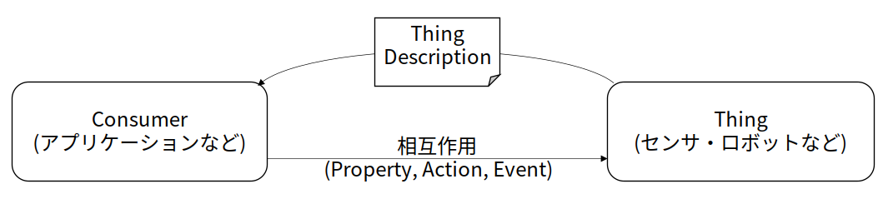
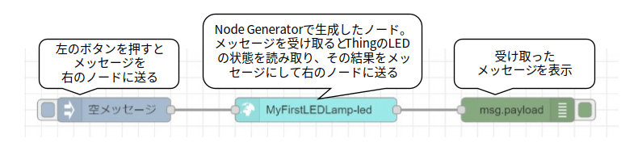
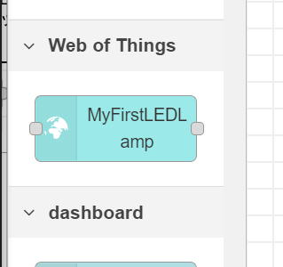
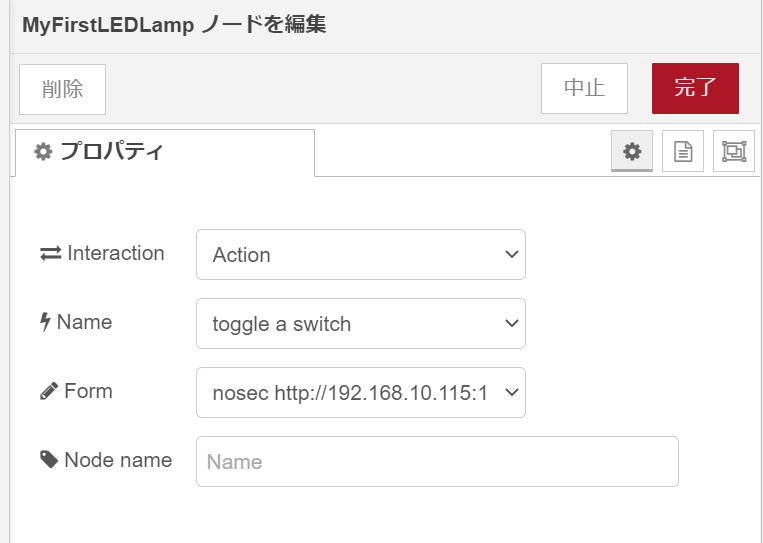
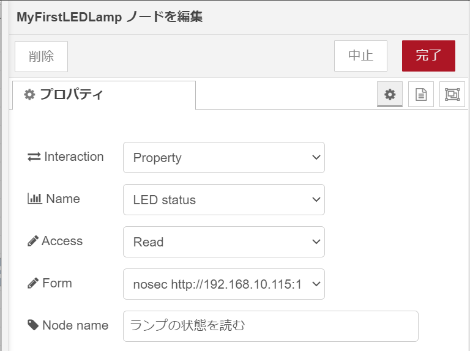
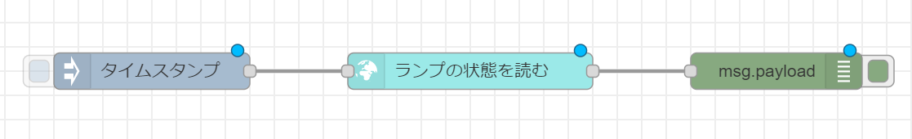
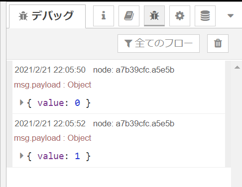
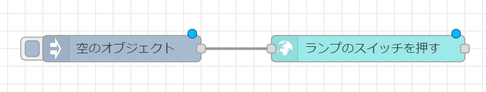
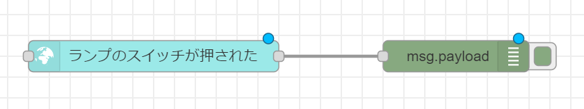
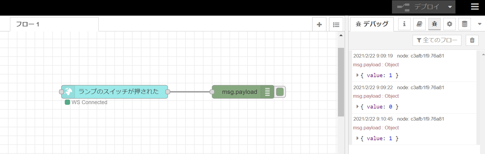

# チュートリアル: Node Generator for Node-REDを使ったThingの操作

## はじめに

本チュートリアルでは、Web of Things(WoT)の関連ツールをつかってモノを操作するアプリケーションを作成する手順を説明します。

Web of Thingsでは、情報を取得したり動作をさせる対象のことを*Thing*と呼びます。また、Thingを操作するアプリケーションのことを*Consumer*と呼びます。このチュートリアルでは、Consumerの作成方法を説明します。



## Node Generator for Node-REDとは

Consumerを作成するツールにはいろいろありますが、ここでは[Node-RED](https://nodered.org/)というフローベースのプログラミング環境に対するヘルパーツールである[Node Generator](https://github.com/node-red/node-red-nodegen)を利用します。

Node-REDでは、画面上で「ノード」と呼ばれる箱をつなぎ合わで、「フロー」を作成することでプログラミングを行います。各ノードは、つなぎ合わされた別のノードからメッセージを受け取り、そのメッセージに対応した処理を行い、また必要であればつなぎ合わされた別のノードへとメッセージを送る、という動作をします。Node Generatorは、Web of ThingsのThingを、Node-RED上のノードとして使えるようにします。作成されたノードは、メッセージを受け取ったらThingに対して相互作用をし、相互作用の結果を次のノードに送る、という動作をします。



下記に、Node-REDとNode Generatorを使ってランプを操作するデモビデオがありますので、参考にしてみてください。

[Node Generatorによるフロー作成デモ](https://github.com/w3c/wot-marketing/raw/master/docs/developers/wot_nodegen.mp4)

## 作成するもの

このチュートリアルでは、本ポータルの[RaspberryPiでThingを作る](raspithing.md)で作ったThingを操作するアプリケーションをNode-REDで作成します。ただし、「RaspberryPiでThingを作る」で作ったThingに対するThing Descriptionには、Thingのアドレスとして`example.com`を使っていましたので、その部分は各自のRaspberryPiに割り当てられた適切なIPアドレスまたはホスト名を使うものとします。そして、そのThingに対して、アプリケーションからランプの状態を取得したり、ランプを点滅させます。

## 環境構築

Consumerを作成するPC等に、下記のソフトウェアをインストールしてください。

- Node-REDのインストール
  - Node-RED User Group Japanの[ローカルでNode-REDを実行する](https://nodered.jp/docs/getting-started/local)を参考にしてください。
- Node Generatorのインストール
  - Node-REDをインストールしたPC等のコマンドラインで下記を実行してください。
  ```
  npm install -g node-red-nodegen
  ```
  - または[Node Generatorのサイト内のドキュメント](https://github.com/node-red/node-red-nodegen/wiki/Japanese#%E3%83%8E%E3%83%BC%E3%83%89%E3%82%B8%E3%82%A7%E3%83%8D%E3%83%AC%E3%83%BC%E3%82%BF%E3%81%AE%E4%BD%BF%E3%81%84%E6%96%B9)を参照してください。


## Thingを利用するアプリの作成

### Thing Descriptionからノードの作成

まず最初に、Node Generatorを使って、Thing Descriptionからノードを作成します。

適当なディレクトリにて下記のコマンドを実行してください。
```
node-red-nodegen /path/to/thing/description.jsonld
```
ここで、`/path/to/thing/description.jsonld`の部分には、「RaspberryPiでThingをつくる」で作ったThing Descriptionの置き場所を書いてください(Thing Description内のホスト名`example.com`を自分の使っているアドレスに置き換えるのを忘れないように)。

このコマンドを実行すると、カレントディレクトリに`node-red-contrib-wotmyfirstledlamp`というディレクトリが作成されて、中にいくつかのファイルが入っていることがわかります。これがNode-REDのノードのソースファイルになります。

これをNode-REDから使えるようにするために、次の作業を行います。まず、Node-REDのユーザディレクトリ(通常、ホームディレクトリ内の`.node-red`)に移動し、そこで下記のコマンドを実行します。
```
npm install /path/to/node-red-contrib-wotmyfirstledlamp
```
ここで、`/path/to/node-red-contrib-wotmyfirstledlamp`には、先ほどNode Generatorで作成したノードのソースファイルが入っているディレクトリを書いてください。

このコマンドを実行するとNode-REDにノードがインストールされますので、Node-REDを再起動してください。

### 作成したノードの使い方

ノードをインストールすると、Node-REDのパレット(左側のノードのリスト)の"Web of Things"カテゴリに作成したノードが表示されるようになります。



このノードをパレットからワークススペース上にドラッグ&ドロップし、ダブルクリックするとノードの設定画面がでてきます。この設定画面をつかって、メッセージを受け取ったときにどのような動作を行うのかの設定を行います。



一番上の'Interaction'が、Thingに対する相互作用(Property/Action/Event)の指定を行う部分です。

Propertyの場合、ノードがメッセージを受け取るとThingに対して指定したプロパティの読み書きを行い、結果を次のノードに送ります。設定画面では、プロパティの名前と読み書きの種類を指定します。

Actionの場合、ノードがメッセージを受け取るとThingに対して指定したアクションの起動を行い、結果を次のノードに送ります。設定画面では、アクションの名前を指定します。

Eventの場合には、Thingでイベントが発生すると、イベントの内容を含んだメッセージを次のノードに送ります。設定画面ではイベントの名前を指定します。

また、各相互作用を実行する際に使用するAPIエンドポイントが複数ある場合は、'Form'から適切なものを選びます。このチュートリアルで使用しているThingには、それぞれ1つずつのAPIエンドポイントしかないため、ここの選択は不要です。

最後の'Node name'の欄は、エディタ上で表示されるノードの名前を指定します。同じThingに対するノードが多数あるとき、あるいはノードのデフォルト名がわかりづらい場合などにわかりやすい名前をつけるとよいでしょう。

### ランプの状態を表示する

最初に単純な例として、ランプの状態を読み取るフローを作成しましょう。このThingは、"LED Status"というプロパティを持っているので、これを読み取るフローを作成します。

まず、MyFirstLEDLampのノードをパレットからワークスペースにドラッグ&ドロップし、ダブルクリックして設定画面を開きます。設定画面では下記のように設定してください
- Interaction: Property
- Name: LED status
- Access: Read
- Form: `nosec http://....`
- Node name: ランプの状態を読む



次に、このノードにメッセージを送るためのノードと、このノードが出力するメッセージを表示するためのノードを前後に追加します。



パレットから、injectノードとdebugノードをそれぞれワークスペース上にドラッグ&ドロップし、injectノードの出力をThingのノードの入力に、Thingのノードの出力をdebugノードの入力につなげます。なお、injectノードはデフォルトではタイムスタンプをメッセージとして出力しますが、プロパティを読むThingのノードはメッセージの内容を無視しますのでデフォルトのままで問題ありません。

フローが完成したら、右上のデプロイボタンをおしてNode-REDのフローを実行状態にします。次に、debugノードの出力を確認するために、右側のサイドバーの上部のタブから"デバッグ"(虫のマーク)を選びます。そして、injectノードの左側のボタンを押すと、Thingのノードにメッセージが送られ、ランプの状態を読み、その情報をdebugノードに送ります。すると、サイドバーに結果が表示されます。RaspberryPiの回路側のボタンをおしてランプの状態を変えてから改めてinjectノードのボタンを押すと、最新の状態が返ってくるのがわかります。



### ランプのスイッチを押す

次に、RaspberryPiのボタンを押すのと同じことをアプリケーション側から実行できるようにしましょう。これは、Thingがもつtoggleアクションを起動することで実現できます。

プロパティを読むときとは異なり、アクションはJSONを受け取るようにThing Descriptionに記述されていました。
```
...
            "forms": [{
                "op": "invokeaction",
                "href": "http://example.com:1880/toggle",
                "contentType": "application/json"
            }]
...
```
このため、今回のフローでは明示的に空のJavaScriptオブジェクトをメッセージとして与えることにします。また、今回は出力に関して特に記述されていないため、Thingからの出力を受け取るdebugノードは省略します。

まず、Thingのノードを下記のように設定します。
- Interaction: Action
- Name: toggle a switch
- Form: `nosec http://...`
- Node name: ランプのスイッチを押す

そして、Thingのノードに空のJavaScriptオブジェクトが入ったメッセージを送るためにinjectノードをつなぎ、下記のように設定します。

- 名前: 空のオブジェクト
- msg.payload = {}

フローは下記のようになります。



このフローをデプロイすると、injectノードの左側のボタンを押すごとにランプが点灯/消灯を繰り返します。

今回はアクションへ与える引数や返り値は使っていませんが、Thingによってはアクションの内容を示す引数や、アクションの結果を示す返り値が返ってくるものもあります。

## ランプからのイベントを受信する

最後に、前節とは逆に、ランプ側のスイッチが押されたことをイベントとして受信するフローを作成します。すなわち、アプリケーション側の動作を契機に何かをThingに対して実行するのではなく、Thing側の動作を契機にアプリケーション側で何かを実行します。ここでは単純にイベントの内容をdebugノードで表示するフローを作りましょう。

まず、Thingのノードを下記のように設定します。
- Interaction: Event
- Name: switch is toggled
- Form: `nosec ws://...`
- Node name: ランプのスイッチが押された

次に、イベントの内容を表示するためにdebugノードをThingノードの右側におきます。debugノードはデフォルトでメッセージのペイロードを表示するようになっているので設定は不要です。

フローは下記のようになります。



このフローをデプロイしてランプのスイッチを押すと、ランプのスイッチを押すたびに右側のサイドバー内のデバッグタブ内に`{ value: 1 }`などと表示されます。この値は、スイッチが押されることによってランプの状態がどうなったかを示すもので、0が消灯、1が点灯を示します。




## 終わりに

本チュートリアルでは、Thing Descriptionから生成したNode-REDのノードを使って、Thingの3つの相互作用を扱う方法を解説しました。

今回は1つのThingだけを扱いましたが、IoTの面白さは2つ以上のThingや他のシステムとの連携にあります。Node-REDはいろいろなシステムを連携させた動作を簡単に記述できます。次のステップとして、たとえばWeb上の天気予報を取得して雨が降りそうならランプを点灯するなどのフローを作ってみるのも面白いかもしれません。