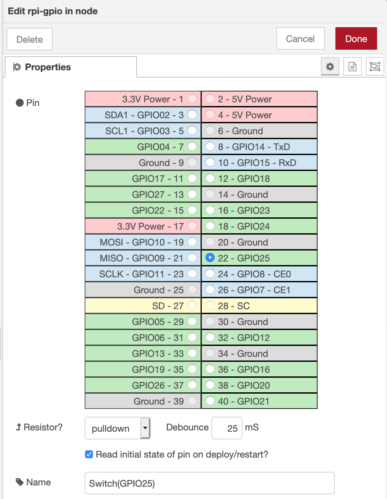
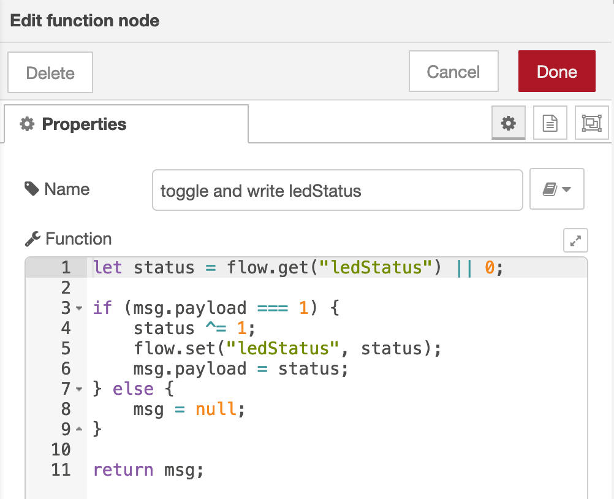
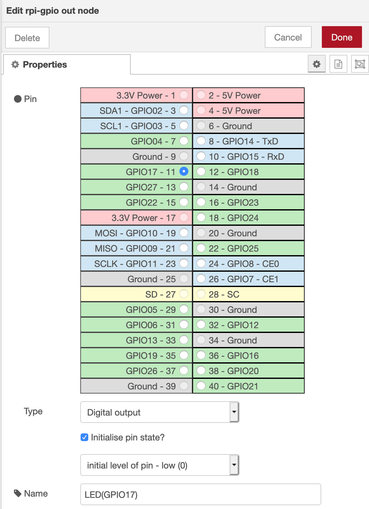
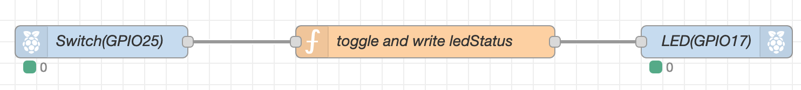
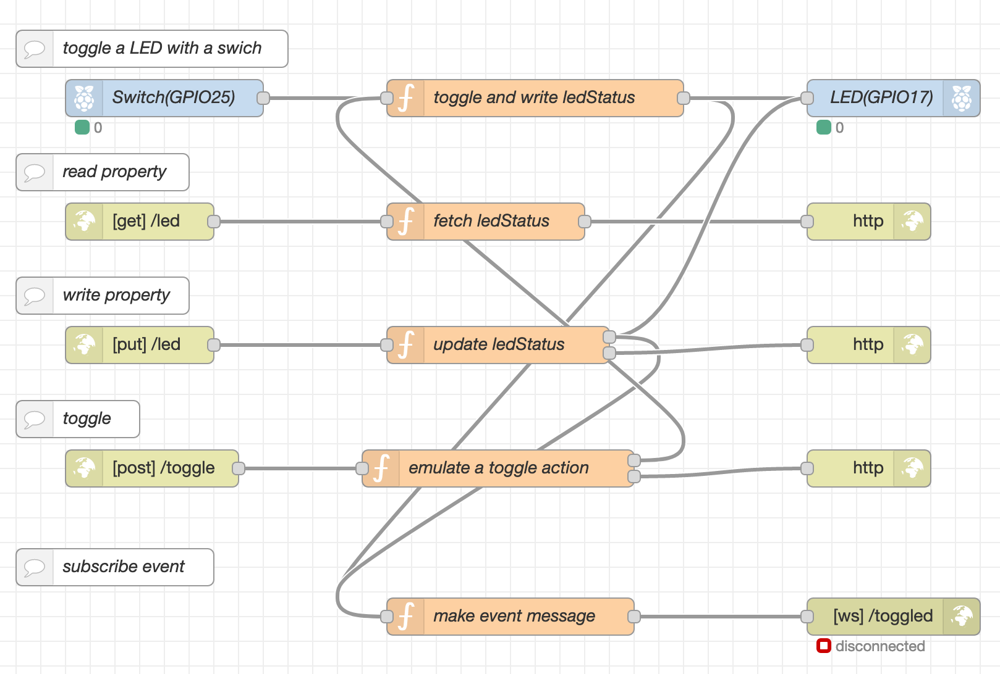
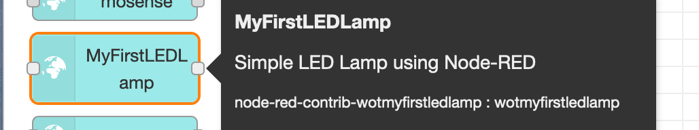
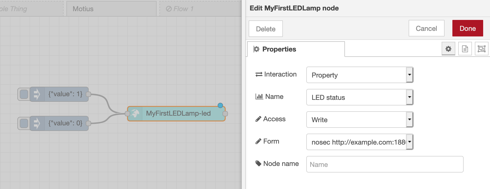

# RaspberryPiでThingを作る

Web of Thingsでは、「Thing Description」と呼ばれる、モノの情報と
アクセス手段が記載された文書を機械可読なかたちで記述します。
そのモノを使ったアプリケーションを作るには、そのモノの
Thing Descriptionを取得し解釈することで適切なアクセス方法がわかるようになります。

Thing Descriptionの作成や解釈には
[node-wot](http://www.thingweb.io/)や
[Node Generator](https://github.com/node-red/node-red-nodegen)などの
既存の開発ツールを使うこともできますが、
ここではWeb of Thingsへの理解をすすめるためにこれらを手作りしていきます。

## つくるもの

LEDランプ
- スイッチでLEDをOn/Offできる
- LEDの状態をネットワークをから読み取れる
- スイッチをネットワークからトグルできる


## 必要なもの

- Raspberry Pi (Raspberry Pi OS利用)
- ブレッドボード
- スイッチ
- LED
- 1kΩ抵抗
- 配線部材

## Raspberry Pi側の準備

LEDとスイッチの間の連携動作や、ネットワークからの要求の処理は、
このチュートリアルではローコードのプログラミング環境である[Node-RED](https://nodered.org)
を使っていきます。インストールに関しては、Node-REDのドキュメントの
[Raspberry Piで実行する](https://nodered.jp/docs/getting-started/raspberrypi)を参照してください。

## LEDランプの回路実装

Raspberry PiのGPIOをつかってLEDとスイッチを制御します。下記のように配線してください。
GPIO17でLEDを点滅、またGPIO25でスイッチの状態を取得します。


## Node-REDでLEDランプをつくる

上記の回路図では、LEDはスイッチと繋がっていないので押しても何も起きません。
スイッチを押したらLEDがつくようにNode-REDで簡単な制御プログラムを書きます。

まずスイッチの状態を取得するために"rpi-gpio in"ノードを使います。
このノードは、指定したGPIOのピンの状態が変化すると変化した状態を
メッセージとして出力します。GPIO25の状態を読み出せるように、下記のように設定
してください。



rpi-gpio inノードの出力をそのままLEDへの入力として使っても良いですが、
スイッチを押している間しかランプがつかないのであまり実用的ではありません。
スイッチを押すごとにOn/Offが切り替わるための仕組みをfunctionノードで作ります。

細かい説明は省きまますが、functionノードで下記のコードを書くと
1が入力されるごとに0あるいは1が交互に出力されます。



そしてこのfunctionノードの出力をLEDに繋ぎます。LEDの制御には"rpi-gpio out"
ノードを使います。



ここまでで書いたフローを下記に示します。

```javascript
[{"id":"e7105a5b.889c3","type":"rpi-gpio in","z":"db517043.485568","name":"Switch(GPIO25)","pin":"22","intype":"down","debounce":"25","read":true,"x":720,"y":120,"wires":[["7a4e69e5.74a628"]]},{"id":"7a4e69e5.74a628","type":"function","z":"db517043.485568","name":"toggle and write ledStatus","func":"let status = flow.get(\"ledStatus\") || 0;\n\nif (msg.payload === 1) {\n    status ^= 1;\n    flow.set(\"ledStatus\", status);\n    msg.payload = status;\n} else {\n    msg = null;\n}\n\nreturn msg;","outputs":1,"noerr":0,"x":1020,"y":120,"wires":[["43b45a34.c6654c"]]},{"id":"43b45a34.c6654c","type":"rpi-gpio out","z":"db517043.485568","name":"LED(GPIO17)","pin":"11","set":true,"level":"0","freq":"","out":"out","x":1290,"y":120,"wires":[]}]
```
スイッチを押すとLEDが点滅することを確認してください。

## Web APIの設計

LEDランプというモノができたところで、次はネットワーク経由でモノを操作可能とするためのインタフェースを作ります。
最低限のインタフェースとしては下記が必要です:
- LEDの状態を取得する
- LEDの状態を変える
- スイッチを押すことを模擬する
- LEDの状態が変わった時に通知を受け取る

### LEDの状態を取得する
ここでは、`/led`というエンドポイントがLEDの状態を
示しており、このエンドポイントに対してGETを行うことで
スイッチの状態が取れるようにします。

状態はJSON(application/json)で`{"value": LEDの状態}`(LEDの状態は0/1)の形式で返されるものとします。

### LEDの状態を変える
LEDの状態取得と同じく、`/led`に対してPUTを行うことで
LEDの状態を変えられるようにします。PUTのペイロードのフォーマットは、
GETと同じくJSONで`{"value": LEDの状態}`(LEDの状態は0/1)という
形式とします。

### スイッチを押すことを模擬する
スイッチを押して離すという動作は、スイッチの状態を0→1→0と変化させる
ことで模擬できますが、もっと直接的に`/toggle`という
エンドポイントにPOSTすることで表現するようにします。

### LEDの状態が変わった時に通知を受け取る
LEDの状態を取得するAPIを定期的に呼び出して状態の変化を
認識することも可能ですが、ネットワークやデバイス/アプリの
負荷を考えると望ましくありません。
ここでは、WebSocketをつかって、`/toggled`というエンドポイントから
状態の変化があるごとに`{"value": LEDの状態}`(LEDの状態は0/1)
というメッセージが送られるようにします。

## Node-REDのフローとして記述する

上記のインターフェースの記述には"http in/response"ノードと
"websocket out"ノードを使います。ここでは
フローの画像とソースを記載しておきますので、
内容を確認してみてください


```javascript
[{"id":"c7df168b.a7f36","type":"rpi-gpio in","z":"db517043.485568","name":"Switch(GPIO25)","pin":"22","intype":"down","debounce":"25","read":true,"x":720,"y":1060,"wires":[["4c460546.0dacfc"]]},{"id":"cc895aa5.9f2b4","type":"rpi-gpio out","z":"db517043.485568","name":"LED(GPIO17)","pin":"11","set":true,"level":"0","freq":"","out":"out","x":1310,"y":1060,"wires":[]},{"id":"4c460546.0dacfc","type":"function","z":"db517043.485568","name":"toggle and write ledStatus","func":"let status = flow.get(\"ledStatus\") || 0;\n\nif (msg.payload === 1) {\n    status ^= 1;\n    flow.set(\"ledStatus\", status);\n    msg.payload = status;\n} else {\n    msg = null;\n}\n\nreturn msg;","outputs":1,"noerr":0,"x":1020,"y":1060,"wires":[["9969ab39.30526","cc895aa5.9f2b4"]]},{"id":"b5036aec.a0af58","type":"http in","z":"db517043.485568","name":"","url":"/led","method":"get","upload":false,"swaggerDoc":"","x":700,"y":1160,"wires":[["f126af95.1dcae8"]]},{"id":"c762170d.70572","type":"http response","z":"db517043.485568","name":"","statusCode":"","headers":{},"x":1290,"y":1160,"wires":[]},{"id":"8d8cd778.842c9","type":"http in","z":"db517043.485568","name":"","url":"/led","method":"put","upload":false,"swaggerDoc":"","x":700,"y":1260,"wires":[["17181653.31f45a"]]},{"id":"3da55d48.7d844a","type":"http response","z":"db517043.485568","name":"","statusCode":"","headers":{},"x":1290,"y":1260,"wires":[]},{"id":"f126af95.1dcae8","type":"function","z":"db517043.485568","name":"fetch ledStatus","func":"let status = flow.get(\"ledStatus\") || 0;\n\nmsg.payload = {value: status};\n\nreturn msg;","outputs":1,"noerr":0,"x":980,"y":1160,"wires":[["c762170d.70572"]]},{"id":"17181653.31f45a","type":"function","z":"db517043.485568","name":"update ledStatus","func":"let msg1 = null;\n\nif (msg.payload.hasOwnProperty(\"value\")) {\n    let s = msg.payload.value;\n    if (s === 1 || s === 0) {\n        msg1 = {payload: s}\n        flow.set(\"ledStatus\", s);\n    } \n}\n\nreturn [msg1, msg];","outputs":2,"noerr":0,"x":990,"y":1260,"wires":[["cc895aa5.9f2b4","9969ab39.30526"],["3da55d48.7d844a"]]},{"id":"835ee10.5396fa","type":"websocket out","z":"db517043.485568","name":"","server":"1dfa7788.d62758","client":"","x":1310,"y":1480,"wires":[]},{"id":"9969ab39.30526","type":"function","z":"db517043.485568","name":"make event message","func":"msg.payload = {value: msg.payload};\nreturn msg;","outputs":1,"noerr":0,"x":1000,"y":1480,"wires":[["835ee10.5396fa"]]},{"id":"380c93fb.95ebac","type":"comment","z":"db517043.485568","name":"toggle a LED with a swich","info":"","x":710,"y":1020,"wires":[]},{"id":"7279cb51.afc024","type":"comment","z":"db517043.485568","name":"read property","info":"","x":670,"y":1120,"wires":[]},{"id":"37b8406c.22e64","type":"comment","z":"db517043.485568","name":"write property","info":"","x":670,"y":1220,"wires":[]},{"id":"89a820d6.9783a","type":"comment","z":"db517043.485568","name":"subscribe event","info":"","x":680,"y":1440,"wires":[]},{"id":"f23ba90d.5565d","type":"comment","z":"db517043.485568","name":"toggle","info":"","x":650,"y":1320,"wires":[]},{"id":"3cc3df7a.152a5","type":"http in","z":"db517043.485568","name":"","url":"/toggle","method":"post","upload":false,"swaggerDoc":"","x":710,"y":1360,"wires":[["ba5fffac.ffbb18"]]},{"id":"ba5fffac.ffbb18","type":"function","z":"db517043.485568","name":"emulate a toggle action","func":"let msg1 = {payload: 1} \nlet msg0 = {payload: 0}\n\nreturn [[msg1,msg0], msg];","outputs":2,"noerr":0,"x":990,"y":1360,"wires":[["4c460546.0dacfc"],["f06a42be.d4def8"]]},{"id":"f06a42be.d4def8","type":"http response","z":"db517043.485568","name":"","statusCode":"","headers":{},"x":1290,"y":1360,"wires":[]},{"id":"1dfa7788.d62758","type":"websocket-listener","z":"","path":"/toggled","wholemsg":"false"}]
```

APIに対してcurlなどでアクセスしてみます。
```
$ curl http://localhost:1880/led
{"value":0}

$ curl -X PUT -d '{"value":1}' -H 'content-type:application/json' http://localhost:1880/led
{"value":1}   # LEDが点灯する
 
$ curl -X POST http://localhost:1880/toggle
# LEDが消灯する

$ wscat -c http://localhost:1880/toggled
Connected (press CTRL+C to quit)
< {"value":1}     # スイッチを押すごとに通知される
< {"value":0}
```

## Thing Descriptionの記述

ここまでで、簡単なIoTデバイスが出来上がりました。
これまでですと、上記のような自然言語で書かれた仕様を
利用者が理解してそれぞれIoTアプリケーションを作っていました。
Web of Thingsでは、上記の仕様をThing Descriptionという
共通フォーマットをつかって記述することで、機械にも人にも
読むことができる仕様書として示すことができます。

詳細な仕様は[Web of Things (WoT) Thing Description](https://www.w3.org/TR/wot-thing-description/)にあります。

Thing DescriptionはJSON-LDをベースとしたフォーマットになっています。ここまでに作成したモノのThing Descriptionをみていきます([Thing Description全体のダウンロード](./raspithingtd.jsonld))。

```javascript
{
    "@context": [
        "https://www.w3.org/2019/wot/td/v1",
    ],
```
このファイルがThing Descriptionであることを示しています。
```javascript
    "id": "urn:dev:mac:00c141ffff25084e",
    "title": "MyFirstLEDLamp",
    "titles": {
        "en": "MyFirstLEDLamp",
        "ja": "私の最初のLEDランプ"
    },
    "description": "Simple LED Lamp using Node-RED",
    "descriptions": {
        "en": "Simple LED Lamp using Node-RED",
        "ja": "Node-REDをつかったシンプルなLEDランプ"
    },
```
このモノの名前や説明を記述します。title,descriptionの記述は多言語で記述可能で、Thing Descriptionの利用アプリケーション側で
適切な言語を選択して表示できるようになっています。
```javascript
    "securityDefinitions": {
        "nosec_sc": {
            "scheme": "nosec"
        }
    },
    "security": [
        "nosec_sc"
    ],
```
このモノにアクセスする際の認証方法などを記載します。
今回はパスワード認証などは付けていないので`nosec`とします。
```javascript
    "properties": {
        "led": {
            "title": "LED status",
            "titles": {
                "en": "LED status",
                "ja": "LEDの状態"
            },
            "type": "object",
            "properties": {
                "value": {
                    "type":"number"
                }
            },
            "forms": [
                {
                    "href": "http://example.com:1880/led",
                    "op": [
                        "readproperty",
                        "writeproperty"
                    ],
                    "contentType": "application/json"
                }
            ]
        }
    },
```
このモノがもつ「プロパティ」とそのプロパティへのアクセス方法を
記述します。`title`から、このモノはLEDの状態を持っており、`forms`から、それらの情報に読み書きアクセス可能であることがわかります。
また、`type`,`properties`から、それらの情報は`{"value":数値}`というJSONで表現されることがわかります。
```javascript
    "actions": {
        "toggle": {
            "title": "toggle a switch",
            "titles": {
                "en": "toggle a switch",
                "ja": "スイッチをトグルする"
            },
            "safe": false,
            "idempotent": false,
            "forms": [{
                "op": "invokeaction",
                "href": "http://example.com:1880/toggle",
                "contentType": "application/json"
            }]
        }
    },
```
このモノが受け付ける「アクション」とそのアクションの起動方法を記述します。
同じく`title`によってこれがスイッチをトグルするアクションであり、`forms`でアクセスの方法がわかります。

```javascript
    "events": {
        "toggled": {
            "title": "switch is toggled",
            "titles": {
                "en": "switch is toggled",
                "ja": "スイッチがトグルされた"
            },
            "data": {
                "type": "object",
                "properties": {
                    "value": {
                        "type": "number"
                    }
                }
            },
            "forms": [
                {
                    "href": "ws://example.com:1880/toggled",
                    "op": "subscribeevent",
                    "contentType": "application/json"
                }
            ]
        }
    }
}
```
最後は「イベント」の情報です。
これまでと同様に、`title`でスイッチのトグルの情報がイベントで取得できること、`forms`でそのイベントを購読する方法が分かります。

ここでは必須でない項目は省いて書いていますが、
これ以外にも他で定義された語彙をつかってより詳しくこの
モノについての説明を書くことができます。
例えば、[Smart Appliances REFerence (SAREF) ontology](https://ontology.tno.nl/saref/)の語彙を使って、
```javascript
{
    "@context": [
        "https://www.w3.org/2019/wot/td/v1",
        { "saref": "https://w3id.org/saref#" }
    ],
    "@type": [
        "saref:Lighting device",
        "saref:LightSwitch"
    ]
    ...
```
と書くことで、このモノが照明とそのスイッチであることが明確になります。

## Thing Descriptionを利用したアプリケーションの作成

このThing Descriptionを読んで、開発者が一から
アプリケーションを作ることもできますが、ここでは
Node-REDとNode generatorを組み合わせてアプリケーションを
作ることを考えます。

Node Generatorは、Thing DescriptionからNode-REDのノードを
自動生成するツールです。詳しい作成方法は[Node Generatorのドキュメント](https://github.com/node-red/node-red-nodegen/wiki#how-to-create-a-node-from-wot-thing-description)をみていただくとして、ここでは生成されたノードを使ったフローの例を示します。

生成したノードをNode-REDに組み込むと、左側のパレット内にこのモノに対応するノードが現れます。



このノードをフロー上に配置し、適切な設定をしてメッセージを送ることで
たのシステムからモノを操作できるようになります。



Thing Descriptionに記載した説明('LED status'など)が設定UI内で使われていることが分かります。
このように、モノの仕様を機械可読なフォーマットで記述することによって、
モノを利用する側でも簡単にアプリケーションが作成できるようになります。

## おわりに

ここではモノとそのAPIの製作から説明しましたが、
ネットワークAPIをもつ既存のモノに対しても
Thing Descriptionが記述できれば同じ手順でアプリケーションが作成できます。
IoTシステムを構築する際にこのチュートリアルがWeb of Thingsを使う
きっかけになればとおもいます。
もし質問や記載の不備などがありましたら、[issueとして登録](https://github.com/wot-jp-community/wot-deployment/issues)していただければ幸いです。
