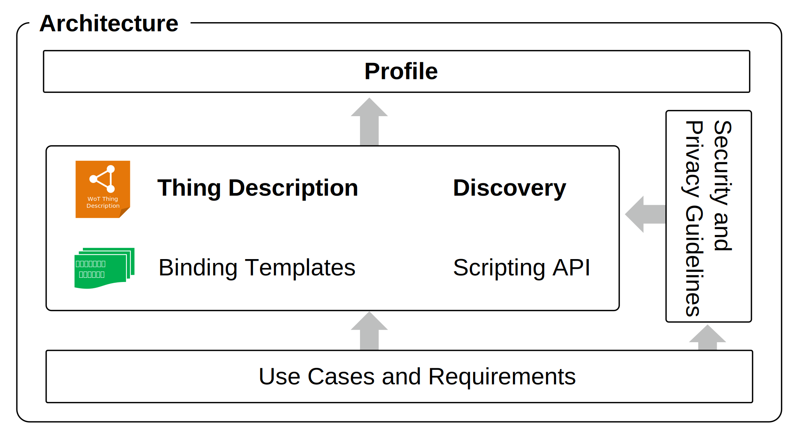

# WoT 仕様の全体像

WoT仕様の全体像や構成要素について、仕様書の関係を説明するとともに、それぞれの仕様を示します。  

## WoT 仕様構成要素

WoTは、下記の計8個の仕様によって構成されています。

- Normative Deliverables
  - Web of Things (WoT) Architecture
  - Web of Things (WoT) Thing Description
  - Web of Things (WoT) Discovery
  - Web of Things (WoT) Profile
- Informative Deliverables
  - Web of Things (WoT) Scripting API
  - Web of Things (WoT) Binding Templates
  - Web of Things (WoT) Security and Privacy Guidelines
  - Web of Things (WoT) Use Cases and Requirements

このようにWoTは、基準となる(Normative)仕様として、W3C勧告(Recommendation)の[Architecture](https://wot-jp-community.github.io/wot-architecture/)および[Thing Description](https://wot-jp-community.github.io/wot-thing-description/)を基盤とし、それらに[Discovery](https://w3c.github.io/wot-discovery/)と[Profile](https://w3c.github.io/wot-profile/)を加えたものが定められています。  
これらのNormativeな仕様は、[Use Cases and Requirements](https://www.w3.org/TR/wot-usecases/)を始点とし、[Security and Privacy Guidelines](https://www.w3.org/TR/wot-security/)という観点からも議論がなされています。  
また、[Scripting API](https://www.w3.org/TR/wot-scripting-api/)や[Binding Templates](https://www.w3.org/TR/wot-binding-templates/)も重要な構成要素として、W3C Working Group ノート(Note)によって示されています。   
詳細は後述の説明や仕様をご確認ください。

仕様書の関係をイメージとして図示したものが下図のものとなります。

これらの仕様が例えば、下図の黒の輪郭線で強調表示されている箇所のように、Web Thing や Thing のアーキテクチャの側面に対して関係しています。

(出典:[Web of Things (WoT) Architecture 和訳: 図25 Thingのアーキテクチャの側面に対するWoT構成要素の関係](https://wot-jp-community.github.io/wot-architecture/#arch-building-blocks))

## W3C勧告(Recommendation)

- Web of Things (WoT) Architecture
  - WoTを用いたIoTシステムの全体アーキテクチャの説明
  - [原文](https://www.w3.org/TR/wot-architecture/)
  - [日本語訳](https://wot-jp-community.github.io/wot-architecture/)
  - [最新の編集者草案 (Architecture 1.1)](https://w3c.github.io/wot-architecture/)

- Web of Things (WoT) Thing Description
  - IoTデバイスを記述するためのThing Description文書の書き方の説明
  - [原文](https://www.w3.org/TR/wot-thing-description/)
  - [日本語訳](https://wot-jp-community.github.io/wot-thing-description/)
  - [最新の編集者草案 (Thing Description 1.1)](https://w3c.github.io/wot-thing-description/)

## W3C Working Group ノート(Note)

- Web of Things (WoT) Binding Templates
  - 個々のプロトコルを使ったデバイスへのアクセスを記述する際の指針の説明
  - [原文](https://www.w3.org/TR/wot-binding-templates/)
  - [最新の編集者草案](https://w3c.github.io/wot-binding-templates/)

- Web of Things (WoT) Scripting API
  - ThingやConsumer上でアプリケーションロジックを実装するための言語インタフェースの指針。node-wotは本ノートに基づいたAPIを提供している。
  - [原文](https://www.w3.org/TR/wot-scripting-api/)
  - [最新の編集者草案](https://w3c.github.io/wot-scripting-api/)

- Web of Things (WoT) Security and Privacy Guidelines
  - WoTをつかってシステムを構築する際のセキュリティおよびプライバシーに関する指針。
  - [原文](https://www.w3.org/TR/wot-security/)
  - [最新の編集者草案](https://w3c.github.io/wot-security/)

## W3C Interest Group ノート(Note)
- Web of Things (WoT) Use Cases and Requirements
  - WoTの全体像や個別の機能仕様を具体例・ユースケースを通して説明している。
  - [原文](https://www.w3.org/TR/wot-usecases/)
  - [最新の編集者草案](https://w3c.github.io/wot-usecases/)

## W3C ドラフト (Draft)
- Web of Things (WoT) Discovery
  - Thing Descriptionの探索方法の説明。新たな探索メカニズムを規定するのではなく、既存メカニズムを使ってTDへのURLを探索する方法と、TDを格納したディレクトリのAPIを規定する予定。
  - [原文](https://www.w3.org/TR/wot-discovery/)
  - [最新の編集者草案](https://w3c.github.io/wot-discovery/)

- Web of Things (WoT): WoT Profile
  - Thing Descriptionで記述可能な仕様は広範囲に及ぶため、"プロファイル"という形で制約を設け、各Thing/Consumerが対応すべき機能範囲を明確にする。
  - [原文](https://www.w3.org/TR/wot-profile/)
  - [最新の編集者草案](https://w3c.github.io/wot-profile/)

- Web of Things (WoT) Architecture 1.1
  - 2020年4月に発行された同文書の改訂版。ライフサイクルやThing Modelに関する記述を追加。
  - [原文](https://www.w3.org/TR/wot-architecture11/)
  - [最新の編集者草案](https://w3c.github.io/wot-architecture/)

- Web of Things Thing Description 1.1
  - 2020年4月に発行された同文書の改訂版。新たな語彙やセキュリティスキームが追加。
  - [原文](https://www.w3.org/TR/wot-thing-description11/)
  - [最新の編集者草案](https://w3c.github.io/wot-thing-description/)
