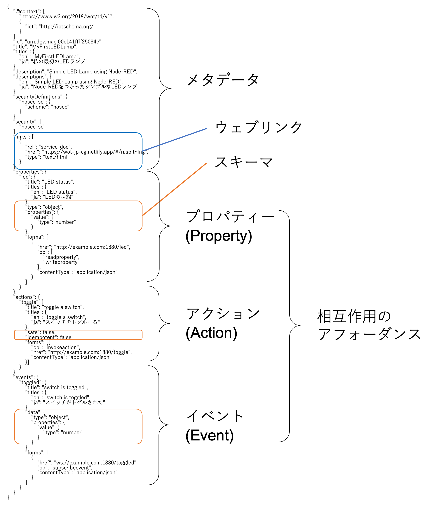

# WoT Thing Description とは

WoT Thing Descriptionは、IoT (Internet of Things) にとっての「Webサイトにおけるindex.html (HTML)」のような基本的記述モデルであり、物理的もしくは仮想的なモノ/デバイスのエントリポイントとみなされるものです。

ここでは、Thing Descriptionの概要と記述方法を[RaspberryPiでThingを作る](./raspithing.md)で作成したモノのThing Descriptionを通してみていきます([RaspberryPiでThingを作る Thing Description全体のダウンロード](https://raw.githubusercontent.com/w3c/wot-jp-cg/main/docs/raspithingtd.jsonld))。  
仕様の詳細は、Web of Things (WoT) Thing Description [原文](https://www.w3.org/TR/wot-thing-description/)または[日本語訳](https://wot-jp-community.github.io/wot-thing-description/)をご覧ください。

### Thing Descriptionの構成

WoTの相互作用モデルでは、3種類の相互作用のアフォーダンスが定義されています。

<table>
  <tr>
    <th>プロパティー(Property)</th><td>Thingの状態を公開する相互作用のアフォーダンス。そして、この公開された状態は、取得 (読み取り) することができる。また、オプションで更新 (書き込み) することができる。Thingは、変更後の新しい状態をプッシュすることにより、プロパティーを監視可能にすることも選択できる。</td>
  </tr>
  <tr>
    <th>アクション(Action)</th><td>状態を操作したり (例えば、照明のオン/オフを切り替える)、Thingにおけるプロセスを始動させる (例えば、時間の経過とともに照明を暗くする) といった、Thingの機能の呼び出しを可能にする相互作用のアフォーダンス。</td>
  </tr>
  <tr>
    <th>イベント(Event)</th><td>イベント (例えば、オーバーヒートの警報) の出どころを記述している相互作用のアフォーダンスで、当該イベントのデータをConsumerに非同期でプッシュする。</td>
  </tr>
</table>

これらの3種類(プロパティー・アクション・イベント)の相互作用の**アフォーダンス**と、
- Thing自身に関するテキスト形式の**メタデータ**
- Thingと交換されるデータの機械が理解できる**スキーマ**
- ウェブ上の他のThingやドキュメントとの形式的または非形式的な関係を表すための**ウェブリンク**

の4つの主要コンポーネントから下図のようにThing Descriptionは構成されています。



## Thing Descriptionの記述方法

Web of Thingsでは、Thing Descriptionという共通フォーマットをつかって記述することで、機械にも人にも読むことができる仕様書として示すことができます。  
Thing DescriptionはJSON-LDをベースとしたフォーマットになっています。  

### Thingのルートオブジェクト・メタデータの記述

はじめに、Thingのルートオブジェクトを記述します。
Thing Descriptionは、Thing型のオブジェクトをルートとするデータ構造です。

```javascript
{
    "@context": [
        "https://www.w3.org/2019/wot/td/v1",
    ],
```
ルート要素として、`@context`でこのファイルがThing Descriptionであることを示します。
```javascript
    "id": "urn:dev:mac:00c141ffff25084e",
    "title": "MyFirstLEDLamp",
    "titles": {
        "en": "MyFirstLEDLamp",
        "ja": "私の最初のLEDランプ"
    },
    "description": "Simple LED Lamp using Node-RED",
    "descriptions": {
        "en": "Simple LED Lamp using Node-RED",
        "ja": "Node-REDをつかったシンプルなLEDランプ"
    },
```
`title`,`description`では、人間が読める形でモノの名前や説明を記述します。多言語で記述可能で、Thing Descriptionの利用アプリケーション側で適切な言語を選択して表示できるようになっています。

<table>
  <tr>
    <th>keyword</th> <th>type</th> <th>説明</th>
  </tr>
  <tr>
    <td>@context</td> <td>anyURIまたは配列</td> <td>TDドキュメント全体で用いる、用語と呼ばれる省略名を定義するためのJSON-LDキーワード。</td>
  </tr>
  <tr>
    <td>title</td> <td>string</td> <td>デフォルトの言語に基づいて、人間が読めるタイトルを提供する (例えば、UI表現用のテキストを表示)。</td>
  </tr>
</table>

これらの必須以外の語彙や詳細は、Thing Description 仕様書の[Thingのコア語彙の定義](https://wot-jp-community.github.io/wot-thing-description/#thing)をご覧ください。

#### セキュリティの記述

```javascript
    "securityDefinitions": {
        "nosec_sc": {
            "scheme": "nosec"
        }
    },
    "security": [
        "nosec_sc"
    ],
```
このモノにアクセスする際の認証方法などを記載します。
例えば、上記のようにパスワード認証などを付けていない場合は`nosec`とします。

<table>
  <tr>
    <th>keyword</th> <th>type</th> <th>説明</th>
  </tr>
  <tr>
    <td>security</td> <td>stringまたはstringの配列</td> <td>セキュリティ定義名の集合。securityDefinitionsで定義されているものから選定する。リソースにアクセスするためには、これらすべてが満たされていなければならない。</td>
  </tr>
  <tr>
    <td>securityDefinitions</td> <td>SecuritySchemeのマップ</td> <td>名前付きセキュリティ構成情報 (定義のみ) の集合。securityの名前-値のペアで名前が用いられていなければ、実際には適用されない。</td>
  </tr>
</table>

これらの必須以外の語彙やセキュリティに関する詳細は、Thing Description 仕様書の
[Thingのコア語彙の定義](https://wot-jp-community.github.io/wot-thing-description/#thing)や[セキュリティ語彙の定義](https://wot-jp-community.github.io/wot-thing-description/#sec-security-vocabulary-definition)をご覧ください。

### 相互作用のアフォーダンスの記述

各アフォーダンスと相互作用を行うための方法を`forms`構造によって示します。

<table>
  <tr>
    <th>keyword</th> <th>type</th> <th>説明</th>
  </tr>
  <tr>
    <td>forms</td> <td>Formの配列</td> <td>操作の実行方法を記述する、フォームのハイパーメディア制御の集合。フォームは、プロトコルバインディングのシリアライゼーションである。</td>
  </tr>
  <tr>
    <td>href</td> <td>anyURI</td> <td>リンクのターゲットIRIまたはフォームの送信ターゲット。</td>
  </tr>
</table>

これら以外の語彙や詳細は、Thing Description 仕様書の[コア語彙の定義](https://wot-jp-community.github.io/wot-thing-description/#sec-core-vocabulary-definition)をご覧ください。
また、プロパティー・アクション・イベントの記述の際には、[InteractionAffordance](https://wot-jp-community.github.io/wot-thing-description/#interactionaffordance)  や [PropertyAffordance](https://wot-jp-community.github.io/wot-thing-description/#propertyaffordance)、
[ActionAffordance](https://wot-jp-community.github.io/wot-thing-description/#actionaffordance)、[EventAffordance](https://wot-jp-community.github.io/wot-thing-description/#eventaffordance) などそれぞれのクラスの定義もご覧ください。

#### プロパティの記述

```javascript
    "properties": {
        "led": {
            "title": "LED status",
            "titles": {
                "en": "LED status",
                "ja": "LEDの状態"
            },
            "type": "object",
            "properties": {
                "value": {
                    "type":"number"
                }
            },
            "forms": [
                {
                    "href": "http://example.com:1880/led",
                    "op": [
                        "readproperty",
                        "writeproperty"
                    ],
                    "contentType": "application/json"
                }
            ]
        }
    },
```
このモノがもつ「プロパティ」とそのプロパティへのアクセス方法を記述します。`title`から、このモノはLEDの状態を持っており、`forms`から、読み書きするときにどのURLにどうアクセスすればよいかがわかります。
また、`type`,`properties`から、それらの情報は`{"value":数値}`というJSONで表現されることがわかります。

#### アクションの記述

```javascript
    "actions": {
        "toggle": {
            "title": "toggle a switch",
            "titles": {
                "en": "toggle a switch",
                "ja": "スイッチをトグルする"
            },
            "safe": false,
            "idempotent": false,
            "forms": [{
                "op": "invokeaction",
                "href": "http://example.com:1880/toggle",
                "contentType": "application/json"
            }]
        }
    },
```
このモノが受け付ける「アクション」とそのアクションの起動方法を記述します。
同じく`title`によってこれがスイッチをトグルするアクションであり、`forms`でアクセスの方法がわかります。

#### イベントの記述

```javascript
    "events": {
        "toggled": {
            "title": "switch is toggled",
            "titles": {
                "en": "switch is toggled",
                "ja": "スイッチがトグルされた"
            },
            "data": {
                "type": "object",
                "properties": {
                    "value": {
                        "type": "number"
                    }
                }
            },
            "forms": [
                {
                    "href": "ws://example.com:1880/toggled",
                    "op": "subscribeevent",
                    "contentType": "application/json"
                }
            ]
        }
    }
}
```
最後は「イベント」の情報です。
これまでと同様に、`title`でスイッチのトグルの情報がイベントで取得できること、`forms`でそのイベントを購読する方法が分かります。

ここでは必須でない項目は省いて書いていますが、
これ以外にも他で定義された語彙をつかってより詳しくこの
モノについての説明を書くことができます。
例えば、[Smart Appliances REFerence (SAREF) ontology](https://ontology.tno.nl/saref/)の語彙を使って、
```javascript
{
    "@context": [
        "https://www.w3.org/2019/wot/td/v1",
        { "saref": "https://w3id.org/saref#" }
    ],
    "@type": [
        "saref:Lighting device",
        "saref:LightSwitch"
    ]
    ...
```
と書くことで、このモノが照明とそのスイッチであることが明確になります。
